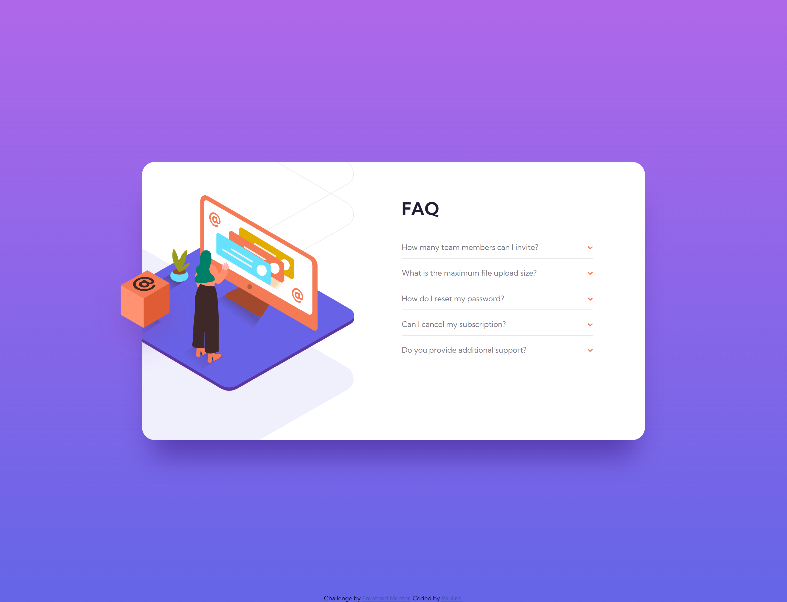

# Frontend Mentor - FAQ accordion card solution

This is my own solution to the [FAQ accordion card challenge on Frontend Mentor](https://www.frontendmentor.io/challenges/faq-accordion-card-XlyjD0Oam). Frontend Mentor challenges help improve coding skills by building realistic projects. 

## Table of contents

- [Overview](#overview)
  - [The challenge](#the-challenge)
  - [Screenshot](#screenshot)
  - [Links](#links)
- [My process](#my-process)
  - [Built with](#built-with)
- [Author](#author)

## Overview

### The challenge

Users should be able to:

- View the optimal layout for the component depending on their device's screen size
- See hover states for all interactive elements on the page
- Hide/Show the answer to a question when the question is clicked

### Screenshot

### Links

- Live Site URL: [FAQ Accordion Card](https://testerium-faq-accordion-card.netlify.app/)

## My process

I finished the project in 5 hours. I had a little problem with the placement of the box image so that it was visible outside the container, but the final result was successful. I had also to rethink the function of closing the question when clicking on the next one, but I managed to do that as well (JavaScript). The project is suitable for desktop and mobile views.

### Built with

- HTML
- CSS 
- SCSS
- Flexbox
- Grid
- JavaScript

## Author

- Frontend Mentor - [@testerium](https://www.frontendmentor.io/profile/testerium)